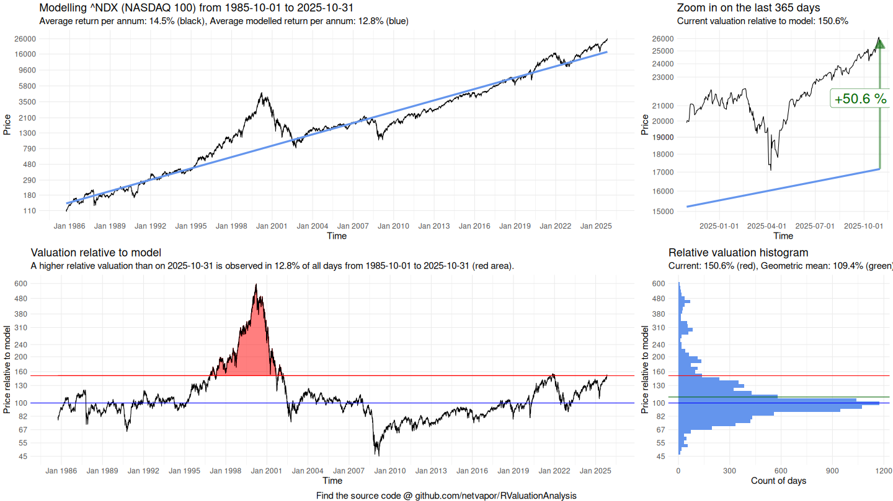
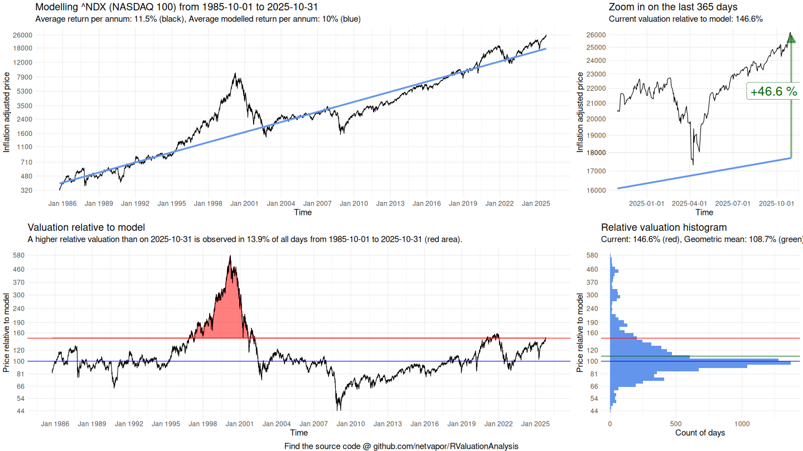

# ValuationAnalysis
Simple R script to model valuation and analyze relative deviations over time.

The model is calculated using the iterated re-weighted least squares algorithm:  
https://en.wikipedia.org/wiki/Iteratively_reweighted_least_squares

You can configure an analysis by modifying the config.yml before running the script:

```
# Symbol to be analyzed
symbol: ^NDX

# Name for the symbol / report title, can be left empty
sybol_name: NASDAQ 100

# Start date of timeframe to be analyzed 
start_date: 1985-10-01

# End date of timeframe to be analyzed (default: today).
end_date: 

# Whether inflation data will be used to adjust historic values to the month of end_date (default: False)
without_inflation:

# Length of the focus timeframe in days
focus_period: 365

# Output chart path, e.g.: "/charts/NDX-2020". Chart format is .png and automatically appended.
# Default: Working directory/symbol
output_file_path: 

# Output chart dimensions (default: [1920, 1080])
chart_size: [1440, 810]

# Output chart text size (default: 15)
text_size: 12

# Distance of breaks for the main axis
main_time_axis_breaks: 3 years

# Distance of breaks for the focus axis
focus_time_axis_breaks: 3 months
```

Example chart output:


Example chart output after using inflation data to adjust historical prices:

